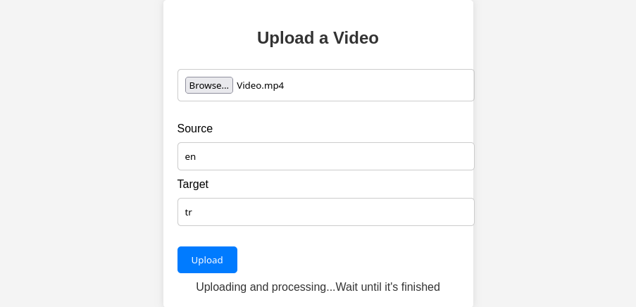
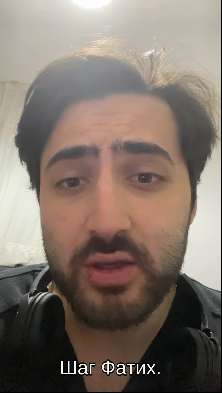

# Video Subtitle Generator

This is a simple application that automatically adds subtitles to a video in the specified language using Go, Fiber, and Python. It utilizes the OpenaAI's Whisper system for transcription and LibreTranslate for translation. I completed this within one day.

## Prerequisites

Before you can use this application, you need to ensure that you have the following dependencies installed:

- [Go](https://golang.org/doc/install)
- [Fiber](https://docs.gofiber.io/guide/getting-started)
- [Python 3](https://www.python.org/downloads/)
- [Whisper ASR](https://whisper.a-i.com/docs/)
- [LibreTranslate](https://libretranslate.com/docs/)

## Installation

1. Clone this repository to your local machine:

    ```bash
    git clone https://github.com/FFC12/autosub.git
    cd autosub
    ```

2. Install Go dependencies:

    ```bash
    go get -d ./...
    ```

3. It will automatically create a Python virtual environment and packages that needed.

## Usage

1. Place the video file you want to add subtitles to in the project directory.

2. Run the application:

    ```bash
    go run main.go
    ```

3. Open your web browser and go to `http://localhost:3000/upload-form`. You will see a simple web interface.



4. Upload your video file, select the target language for subtitles, and click the "Generate Subtitles" button.

5. The application will process the video, transcribe the audio using Whisper, translate the transcription using LibreTranslate, and then generate subtitles.


6. Once the process is complete, you can download the video with subtitles.



## Contributing

If you'd like to contribute to this project or report issues, please feel free to create a pull request or issue on GitHub.

## License

This project is licensed under the MIT License. See the [LICENSE](LICENSE) file for details.


## Disclaimer

This application is provided as-is and without warranty. Use it responsibly and ensure you have the necessary rights to use the video and content generated by this application.
